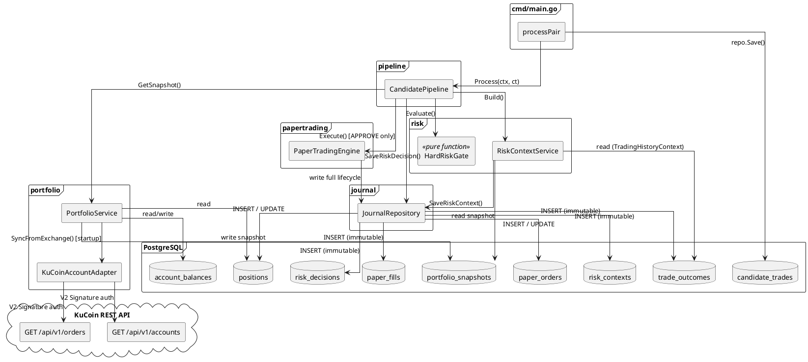
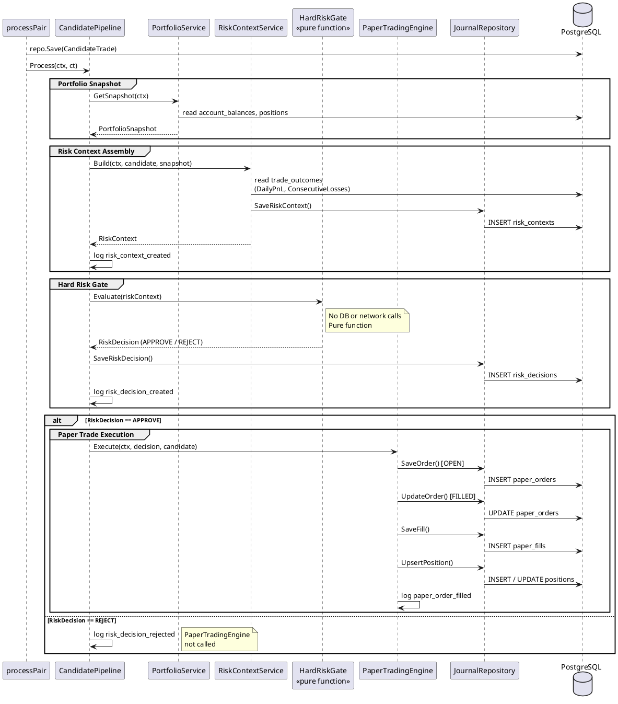
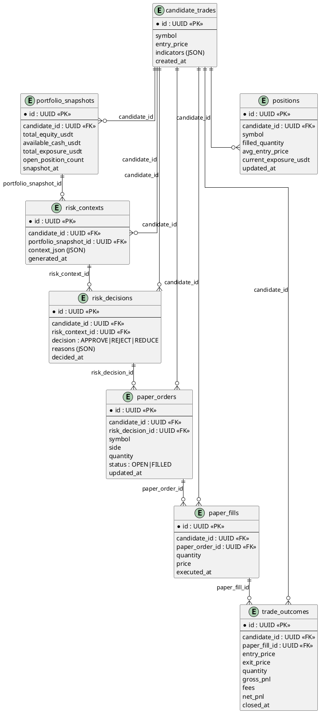

Status: ready-for-agent

# Spec: Week 3–4 Portfolio Service, Risk Context Service, Journal Service, and Paper Trading

---

## Problem Statement

The trading system can generate `CandidateTrade` records, but nothing happens after they are persisted. There is no portfolio awareness (balance, positions, exposure), no risk evaluation before acting on a signal, no record of what happened to each candidate, and no protection against trading into an overexposed or loss-limited state. The system cannot answer: "Was this candidate safe to act on? What happened next? Why?" Without this infrastructure, the AI Risk Manager (Week 7–8) has nothing structured to evaluate and no history to reason over.

---

## Solution

Extend the `trading_bot` binary with five new internal packages: `portfolio`, `risk`, `journal`, `papertrading`, and `pipeline`. When a `CandidateTrade` is created by the Strategy Engine, a `CandidatePipeline` orchestrates: portfolio snapshot retrieval, risk context assembly, hard risk rule evaluation, and (on approval) paper trade execution with full journal persistence. All of this runs in paper trading mode — no real orders, no real money — producing a realistic lifecycle record that will feed the AI Risk Manager and RAG service in later weeks.

---

## Architecture

### Component Diagram



### Pipeline Sequence Diagram



### Journal Record Linkage (FK Chain)



---

## User Stories

1. As a developer, I want a `PortfolioService` interface that returns account balances, open orders, and a portfolio snapshot, so that risk context assembly has a single, mockable source for portfolio state.
2. As a developer, I want the `PortfolioService` to synchronize from KuCoin's REST API on application startup (Phase 1), so that the internal DB reflects the real account state before the first pipeline run.
3. As a developer, I want a `KuCoin AccountAdapter` that fetches account balances and open spot orders using KuCoin V2 Signature authentication, so that the portfolio sync is authenticated and exchange-agnostic at the domain boundary.
4. As a developer, I want internal portfolio state stored in PostgreSQL tables (`account_balances`, `orders`, `portfolio_snapshots`), so that state survives restarts and is available for risk context assembly without hitting KuCoin on every signal.
5. As a developer, I want KuCoin to be the source of truth — on any reconciliation conflict, exchange data wins — so that internal state never diverges silently from reality.
6. As a developer, I want a `PortfolioSnapshot` captured at the moment a `CandidateTrade` is evaluated, so that the exact portfolio state used in every risk decision is preserved immutably for audit and RAG.
7. As a developer, I want exposure calculated as `Quantity × Price` per asset and summed to total exposure, so that the risk gate can compare candidate exposure against portfolio-level limits.
8. As a developer, I want a `RiskContext` struct that aggregates `CandidateTrade`, `PortfolioSnapshot`, `PositionRiskContext`, `TradingHistoryContext`, `RiskLimits`, and `MarketRiskContext` into a single serializable envelope, so that the future LLM Risk Manager receives all relevant facts without querying any database or service directly.
9. As a developer, I want a `RiskContextService` that assembles `RiskContext` from portfolio and journal data, so that context assembly is a single testable operation with no side effects.
10. As a developer, I want `TradingHistoryContext` to include recent win/loss count, daily PnL, and consecutive losses derived from journal data, so that the risk gate and future LLM can factor in recent strategy performance.
11. As a developer, I want `RiskLimits` to be fully config-driven (max daily loss, max portfolio exposure, max symbol exposure, max open positions, max consecutive losses), so that risk thresholds can be changed without code changes.
12. As a developer, I want a `HardRiskGate` that evaluates a `RiskContext` against `RiskLimits` and returns a `RiskDecision` (APPROVE / REJECT / REDUCE), so that every candidate is evaluated against deterministic hard limits before any AI involvement.
13. As a developer, I want the `HardRiskGate` to reject on daily loss limit exceeded, so that the bot stops trading after a configured drawdown threshold.
14. As a developer, I want the `HardRiskGate` to reject on total portfolio exposure limit exceeded, so that the bot never over-allocates capital across all open positions.
15. As a developer, I want the `HardRiskGate` to reject on symbol exposure limit exceeded, so that the bot never concentrates too much capital in a single asset.
16. As a developer, I want the `HardRiskGate` to reject when open positions are at the configured maximum, so that position count is bounded.
17. As a developer, I want the `HardRiskGate` to reject on consecutive losses exceeding the configured threshold, so that the bot pauses after a losing streak.
18. As a developer, I want the `HardRiskGate` to reject on insufficient available balance, so that orders are never attempted without enough capital.
19. As a developer, I want the `HardRiskGate` to be a pure function with no database or network calls, so that it is fast, fully unit-testable, and deterministic.
20. As a developer, I want the `HardRiskGate` to run both before and after the LLM Risk Manager (double-gate), so that the LLM cannot override hard limits even if it returns APPROVE on a disqualified candidate.
21. As a developer, I want a `RiskDecision` record persisted to the journal as an immutable insert immediately after the `HardRiskGate` evaluates, so that every decision — including REJECTs — is traceable.
22. As a developer, I want `RiskDecision.Reasons` to contain named string constants (e.g. `DAILY_LOSS_LIMIT_EXCEEDED`, `INSUFFICIENT_BALANCE`), so that rejection reasons are human-readable and machine-parseable.
23. As a developer, I want a `PaperTradingEngine` that generates a synthetic `OrderFilled` at the candidate's entry price when a candidate is APPROVED, so that the full journal lifecycle can be tested and exercised without placing real orders on KuCoin.
24. As a developer, I want the paper trading engine to write a synthetic order, fill, and portfolio position update to the journal tables, so that trade history statistics (win rate, daily PnL, consecutive losses) are populated for subsequent risk context assembly.
25. As a developer, I want `CandidateJournal` records to be immutable inserts — never updated after creation — so that the exact indicator snapshot and market context that produced the candidate is preserved for audit and RAG.
26. As a developer, I want `RiskContext` records to be immutable inserts, so that the exact portfolio state at decision time is preserved and cannot be overwritten by later portfolio changes.
27. As a developer, I want `RiskDecision` records to be immutable inserts, so that the AI cannot retroactively alter what decision was made.
28. As a developer, I want `Order` and `Position` records to be mutable with `updated_at` tracking, so that operational state transitions (PENDING → OPEN → FILLED) are reflected correctly.
29. As a developer, I want a `TradeOutcome` record written when a paper position is closed, containing entry price, exit price, quantity, gross PnL, fees, and net PnL, so that strategy performance statistics can be computed from the journal.
30. As a developer, I want all journal records linked by a `candidate_id` foreign key chain (`candidate → risk_context → risk_decision → order → fill → trade_outcome`), so that the complete lifecycle of any trade is reconstructable from a single candidate ID.
31. As a developer, I want all journal tables to use `ON CONFLICT DO NOTHING` on their natural business key, so that idempotent re-processing never creates duplicate records.
32. As a developer, I want a `CandidatePipeline` struct that orchestrates portfolio snapshot → risk context → hard gate → paper execution → journal, so that `processPair` stays thin and the pipeline is independently testable.
33. As a developer, I want `processPair` to call `CandidatePipeline.Process(ctx, ct)` after `repo.Save(ctx, ct)`, so that pipeline failure is non-fatal and does not prevent the candidate from being persisted.
34. As a developer, I want structured `slog` log events emitted at each pipeline stage (risk_context_created, risk_decision_created, paper_order_filled, trade_outcome_created) with `candidate_id` in every event, so that the full lifecycle is traceable in logs.
35. As a developer, I want the portfolio sync to be non-fatal on startup failure — proceeding with an empty portfolio snapshot — so that the bot continues to paper-trade even if KuCoin is temporarily unreachable.
36. As a developer, I want spot trading only in Week 3–4 (no leverage, no margin, no futures), so that the `Position` model stays simple and the risk calculations have no liquidation complexity.
37. As a developer, I want all new packages (`portfolio`, `risk`, `journal`, `papertrading`, `pipeline`) to be internal to the `trading_bot` module with no cross-package database writes, so that data ownership is explicit and the system remains a single deployable binary.

---

## Implementation Decisions

- **One binary, separate Go packages**: `portfolio`, `risk`, `journal`, `papertrading`, and `pipeline` are packages inside the `trading_bot` module. No new binaries, no gRPC, no HTTP between components. Package interfaces enforce data ownership — no package writes directly to another package's tables.

- **KuCoin is source of truth**: The internal DB is a synchronized mirror. On startup, Phase 1 REST sync populates `account_balances` and `orders` from KuCoin. Phase 2 (WebSocket) and Phase 3 (REST interval) are out of scope for Week 3–4.

- **KuCoin V2 Signature authentication**: The `AccountAdapter` adds `KC-API-KEY`, `KC-API-SIGN` (HMAC-SHA256 of `timestamp + method + path + body`), `KC-API-TIMESTAMP`, `KC-API-PASSPHRASE` (HMAC-SHA256 of passphrase), and `KC-API-KEY-VERSION=2` headers on every authenticated request.

- **Spot trading only**: `Position` tracks asset holdings derived from fills. No leverage, no margin, no liquidation price. `Exposure = FilledQuantity × CurrentPrice`.

- **`HardRiskGate` is a pure function**: `func (g *HardRiskGate) Evaluate(ctx RiskContext) RiskDecision`. It reads `RiskContext` and `RiskLimits` only. No DB calls, no network calls. Runs before the (future) LLM call and again after — the second pass ensures the LLM cannot produce an APPROVE that violates limits.

- **`RiskDecision` type**:
  ```
  APPROVE — all hard limits pass; proceed to paper execution
  REJECT  — one or more hard limits violated; record reason, skip execution
  REDUCE  — reserved for future use (position sizing reduction); treated as APPROVE in Week 3–4
  ```

- **Paper trading synthetic fill**: Entry price = `CandidateTrade.EntryPrice` (= candle close price at signal time). No slippage model in Week 3–4. Fill is written immediately with no simulated latency.

- **Journal immutability contract**:
  - Immutable (INSERT only, never UPDATE): `candidate_journal`, `risk_contexts`, `risk_decisions`, `paper_fills`, `trade_outcomes`
  - Mutable with `updated_at`: `paper_orders` (status transitions), `positions` (quantity and PnL updates)

- **`TradingHistoryContext` data source**: Derived from `trade_outcomes` table in the journal. `DailyPnL` = sum of `net_pnl` for `closed_at >= today 00:00 UTC`. `ConsecutiveLosses` = count of trailing losses from most recent completed trades.

- **`RiskContext` raw storage**: `risk_contexts` table stores the full assembled `RiskContext` as a JSON column alongside the structured foreign key to `candidate_id` and `portfolio_snapshot_id`. This enables the future LLM to receive a pre-serialized context without re-assembling it.

- **`CandidatePipeline` wiring in `cmd/main.go`**: Instantiated once at startup and injected into `processPair` alongside the existing `Factory` and `Repository`. `processPair` calls `pipeline.Process(ctx, ct)` only when `factory.Create()` returns a non-nil candidate (not a duplicate). Pipeline failure is logged but does not halt the process.

- **Config additions**: `cfg.KuCoin` (API key, secret, passphrase, base URL) and `cfg.RiskLimits` (all six thresholds) added to the existing JSON config struct. Defaults:
  ```
  MaxDailyLossUsdt:        300
  MaxPortfolioExposureUsdt: 5000
  MaxSymbolExposureUsdt:   2000
  MaxOpenPositions:        5
  MaxConsecutiveLosses:    3
  MinOrderSizeUsdt:        10
  ```

- **Database migrations**: Six new tables added via `golang-migrate`, following the same embed + `iofs` pattern as existing `candidate_trades`. All `id` columns are UUIDs. All `candidate_id` columns are foreign keys to `candidate_trades.id`.

- **sqlc codegen**: All new SQL queries use sqlc-generated code, consistent with existing patterns in `trading_bot/internal/database/generated/`.

---

## Testing Decisions

A good test verifies observable behavior at the highest testable seam. Tests must be fast, offline (no live KuCoin), and deterministic. Do not test internal computation directly when the public interface can exercise it.

**Seam 1 — `HardRiskGate.Evaluate(RiskContext) RiskDecision`**
- Pure function: no DB, no mocks needed.
- Required cases: each of the 6 reject rules triggered individually (daily loss, portfolio exposure, symbol exposure, open positions, consecutive losses, insufficient balance), plus the happy-path approve case where all limits pass.
- Verify `RiskDecision.Decision` and `RiskDecision.Reasons` for every case.
- Prior art: `internal/strategy/divergence/strategy_test.go` (same pattern — construct context struct, call method, assert output).

**Seam 2 — `CandidatePipeline.Process(ctx, *CandidateTrade)`**
- Use stub implementations of `PortfolioService`, `RiskContextService`, `PaperTradingEngine`, and `JournalRepository` interfaces.
- Required cases: REJECT path (hard gate fires, paper engine not called, rejection journaled); APPROVE path (gate passes, paper engine called, lifecycle journaled).
- Verify that the paper engine is not called when the gate rejects.
- Verify that all journal writes receive the correct `candidate_id`.
- Prior art: no direct prior art in this repo; use standard Go interface mocking with hand-written stubs (no mock generation framework).

**Seam 3 — Full integration with real DB**
- Spin up a real PostgreSQL instance (testcontainers, matching the pattern in `auth` and `email_consumer` controller tests).
- Use a mock `KuCoin AccountAdapter` that returns hardcoded balances and no open orders.
- Run the full `CandidatePipeline.Process()` with a constructed `CandidateTrade`.
- Verify that rows exist in `risk_contexts`, `risk_decisions`, `paper_orders`, `paper_fills` tables.
- Verify that all rows share the same `candidate_id`.
- Verify that re-processing the same `CandidateTrade` produces exactly the same number of rows (idempotency).

---

## Out of Scope

- WebSocket subscription to KuCoin for real-time balance/order/position updates (Phase 2 — future week)
- Periodic REST reconciliation interval (Phase 3 — future week)
- Real order submission to KuCoin (requires execution service — future week)
- LLM Risk Manager integration (Week 7–8)
- RAG / vector database (Week 5–6)
- Futures, margin, leverage, or liquidation logic
- Multi-exchange support
- Stop-loss and take-profit price calculation (no execution layer yet)
- Automatic reconciliation correction — on hard mismatch, the system logs and alerts; no auto-correction

---

## Vertical Slices

Each slice is independently deliverable, has a clear done condition, and leaves the system in a working state. Slices are ordered by dependency — each one builds on the previous.

---

### Slice 1 — Database migrations and sqlc codegen

Deliverable: All new PostgreSQL tables exist and sqlc-generated query code compiles.

New tables: `account_balances`, `portfolio_snapshots`, `positions`, `paper_orders`, `paper_fills`, `risk_contexts`, `risk_decisions`, `trade_outcomes`.

Done when:
- All migrations run cleanly against a local PostgreSQL instance
- sqlc generates typed query functions for every new table
- `go build ./...` passes with zero errors
- All `id` columns are UUIDs; all `candidate_id` columns are foreign keys to `candidate_trades.id`
- Immutable tables have no UPDATE queries in sqlc schema

No business logic. No KuCoin calls. No structs beyond what sqlc generates.

---

### Slice 2 — Portfolio domain and KuCoin AccountAdapter

Deliverable: `PortfolioService` can sync from KuCoin REST on startup and return a `PortfolioSnapshot` with correct exposure.

Done when:
- `AccountAdapter.GetBalances()` fetches spot account balances from KuCoin using V2 Signature authentication
- `AccountAdapter.GetOpenOrders()` fetches open spot orders from KuCoin
- `PortfolioService.SyncFromExchange(ctx)` writes fetched balances and orders to DB; exchange data overwrites existing rows
- `PortfolioService.GetSnapshot(ctx)` returns equity, available cash, total exposure, and open position count derived from DB state
- Exposure calculated as `Quantity × Price` per asset, summed to total
- Startup sync failure is non-fatal: service proceeds with empty portfolio
- Unit tests cover exposure calculation with known quantities and prices

No risk logic. No journal writes. No pipeline.

---

### Slice 3 — Journal package

Deliverable: All journal structs exist with correct immutability contracts, and the `JournalRepository` can persist every record type.

Done when:
- `JournalRepository` has INSERT-only methods for `risk_contexts`, `risk_decisions`, `paper_fills`, `trade_outcomes` (no UPDATE methods on these types)
- `JournalRepository` has INSERT + UPDATE methods for `paper_orders` and `positions`
- All INSERT methods use `ON CONFLICT DO NOTHING` on their natural business key
- `candidate_id` is present on every record type and correctly threaded through repository calls
- Struct definitions exist for `RiskContext`, `RiskDecision`, `PaperOrder`, `Fill`, `Position`, `TradeOutcome`

No business logic. No pipeline. No KuCoin calls.

---

### Slice 4 — HardRiskGate

Deliverable: `HardRiskGate.Evaluate(RiskContext) RiskDecision` enforces all six hard risk rules as a pure function.

Done when:
- REJECT on `DailyPnL <= -MaxDailyLoss` with reason `DAILY_LOSS_LIMIT_EXCEEDED`
- REJECT on `TotalExposure + candidateExposure > MaxPortfolioExposure` with reason `PORTFOLIO_EXPOSURE_EXCEEDED`
- REJECT on `SymbolExposure + candidateExposure > MaxSymbolExposure` with reason `SYMBOL_EXPOSURE_EXCEEDED`
- REJECT on `OpenPositions >= MaxOpenPositions` with reason `MAX_OPEN_POSITIONS_REACHED`
- REJECT on `ConsecutiveLosses >= MaxConsecutiveLosses` with reason `CONSECUTIVE_LOSSES_EXCEEDED`
- REJECT on `AvailableBalance < MinOrderSizeUsdt` with reason `INSUFFICIENT_BALANCE`
- APPROVE when all limits pass
- No DB calls, no network calls in `Evaluate()`
- Seam 1 test suite passes (7 cases: 6 reject + 1 approve)

No pipeline. No journal writes.

---

### Slice 5 — RiskContextService

Deliverable: `RiskContextService.Build(ctx, candidate)` assembles a complete `RiskContext` from portfolio and journal data and persists it as an immutable record.

Done when:
- `Build()` retrieves `PortfolioSnapshot`, derives `PositionRiskContext` (existing exposure per symbol, open position count), and derives `TradingHistoryContext` (daily PnL, consecutive losses, win rate) from `trade_outcomes` in the journal
- `MarketRiskContext` is populated from `CandidateTrade.Indicators`
- `RiskLimits` populated from config
- Assembled `RiskContext` is persisted to `risk_contexts` table as an immutable insert with its JSON representation
- `RiskContext.GeneratedAt` is set at assembly time

---

### Slice 6 — PaperTradingEngine

Deliverable: `PaperTradingEngine.Execute(ctx, decision, candidate)` generates a synthetic fill and writes the complete paper trade lifecycle to the journal.

Done when:
- A `paper_orders` row is created with status `OPEN`, then immediately updated to `FILLED`
- A `paper_fills` row is created with `Quantity`, `Price = candidate.EntryPrice`, and `ExecutedAt = now`
- A `positions` row is created or updated to reflect the new holding
- No real KuCoin order is placed
- All written records carry the same `candidate_id`
- Structured `slog` event `paper_order_filled` is emitted with `candidate_id`, `symbol`, `side`, `fill_price`

---

### Slice 7 — CandidatePipeline and binary wiring

Deliverable: `CandidatePipeline.Process()` orchestrates all prior slices end-to-end, and `processPair` in `cmd/main.go` calls it after persisting the candidate.

Done when:
- `CandidatePipeline.Process(ctx, ct)` runs: portfolio snapshot → risk context → hard gate → (if APPROVE) paper execution
- REJECT path: `RiskDecision` is journaled, paper engine is not called, structured log `risk_decision_rejected` emitted
- APPROVE path: `RiskDecision` journaled, paper engine called, full lifecycle written
- `processPair` calls `pipeline.Process(ctx, ct)` after `repo.Save(ctx, ct)`; pipeline error is logged but non-fatal
- `cmd/main.go` wires `AccountAdapter`, `PortfolioService`, `RiskContextService`, `HardRiskGate`, `PaperTradingEngine`, `JournalRepository`, and `CandidatePipeline` at startup
- KuCoin credentials and risk limits loaded from JSON config
- End-to-end manual test: start the binary, observe `risk_context_created`, `risk_decision_created`, and `paper_order_filled` log events and matching DB rows

---

### Slice 8 — Test suites

Deliverable: All three test seams are covered and passing.

Done when:
- **Seam 1**: `HardRiskGate` unit tests pass for all 7 cases (6 reject + 1 approve) — no DB, no mocks
- **Seam 2**: `CandidatePipeline` tests with hand-written stubs pass for REJECT path (paper engine not called) and APPROVE path (paper engine called, journal writes carry correct `candidate_id`)
- **Seam 3**: Integration test with testcontainers PostgreSQL passes — rows exist in `risk_contexts`, `risk_decisions`, `paper_orders`, `paper_fills` after `Process()`; all rows share the same `candidate_id`; re-processing the same candidate produces no additional rows (idempotency)

---

## Further Notes

- The `CandidatePipeline` is designed so that replacing `PaperTradingEngine` with a real `KuCoinExecutionEngine` in a future week requires no changes to `Portfolio`, `Risk`, `Journal`, or `processPair`.
- The double-gate architecture (HardRiskGate before and after LLM) is the permanent enforcement boundary. When the LLM is introduced in Week 7–8, it is inserted between the two gate passes — it does not replace either pass.
- `TradingHistoryContext` statistics derived from `trade_outcomes` will initially reflect paper trades only. This is intentional: the statistics accumulate over time and will be meaningful after several days of paper trading.
- The `RiskContext` JSON column in `risk_contexts` is the primary input the LLM will receive in Week 7–8. Storing it now ensures the schema is stable before the LLM integration begins.
- Phase 2 (WebSocket) should be implemented before switching from paper trading to live execution, since polling alone is too slow for accurate fill detection in a live system.
